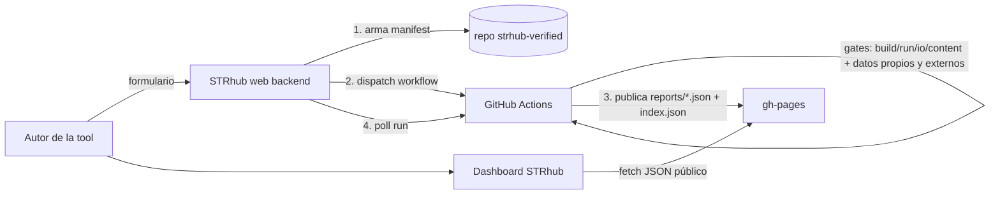

# Plan — STRhub Verified (certificación self-service de tools forenses)

> Estado: borrador de trabajo. Documenta la visión, las decisiones tomadas y el
> roadmap por fases. La Fase 1 ya está implementada (ver §7).

## 1. Visión

STRhub Verified responde **una** pregunta, la que un revisor más necesita y menos
puede chequear a mano:

> ¿Esta herramienta realmente se instala y corre de principio a fin, produciendo
> output en el formato documentado, en un entorno declarado?

**No** es un benchmark de concordancia/exactitud, **no** es validación para
casework, **no** es un ranking. Cada atestación lleva su *scope* explícito.

El objetivo de producto: que **un autor con una tool nueva pueda certificarla
solo, sin intervención del mantenedor**, siguiendo pasos simples, y que cualquiera
pueda ver el resultado en un **link fácil y permanente**.

## 1.bis Modelo de verificación en 3 niveles

STRhub Verified tiene tres niveles. El 1 es el producto; el 2 existe solo para lo
que el 1 estructuralmente no puede correr; el 3 no se diseña todavía.

| Nivel | Qué | Precio | Estado |
|---|---|---|---|
| **1 · Auto-run** | Docker + GitHub Actions, la escalera de gates (§12.3) | gratis, siempre | ✅ vigente, sin cambios |
| **2 · Verificación manual** | El mantenedor corre la tool a mano y emite un certificado etiquetado **"verificación manual"** | pago (consultoría, fuera de plataforma) | ✅ implementado |
| **3 · Certificación judicial** | Sellada, multi-jurisdiccional, admisibilidad legal por país | — | ⬜ no se diseña: requiere resolver legislación país por país primero |

### El trigger de nivel 2 es objetivo, no un juicio

Todo el diseño del nivel 2 gira alrededor de una sola propiedad: **STRhub nunca
elige quién califica.** La elegibilidad es un `reason_code` que emite el motor
desde la evidencia de la propia corrida, y la web solo lo lee. Ante cualquier
sospecha de arbitrariedad, la respuesta es el run público + el código.

Dos disparadores, ambos detectables:

- **A · declarado (pre-flight)** — el autor marca en el form una propiedad de su
  herramienta que el runner gratuito no puede dar (GUI, GPU, red en runtime,
  referencia licenciada, SO no soportado, salida opaca). Bloquea el submit y
  rutea a nivel 2 *sin gastar una corrida de CI* que solo podría fallar.
- **B · detectado (post-run)** — el log prueba que chocamos contra uno de esos
  techos (`oom`, `disk_full`, `runtime_network`, `requires_gui`, `requires_gpu`,
  `requires_license`).

**Lo que explícitamente NO es trigger:** que el autor tenga dificultad con el
formulario. Una versión anterior de esta idea incluía *"el usuario no puede
adaptar su tool al formato que Verified necesita"* como disparador; se **eliminó**
por dos razones:

1. Es subjetivo — "no puede" y "está trabado" son la misma frase, y meten juicio
   humano justo donde no debe haberlo.
2. Cobrar por eso sería **monetizar la fricción de nuestro propio formulario**:
   cuanto peor el form, más ingresos. Incentivo perverso.

La dificultad con el form se atiende **gratis**, por el canal de contacto.

### Las tres barreras que hacen que no se pueda abusar

1. **No existe el botón.** El CTA de nivel 2 vive únicamente en la página de un
   reporte que el motor marcó elegible. Quien está trabado *en el formulario*
   todavía no tiene reporte: no hay nada que apretar. La mitigación es
   estructural, no una regla que haya que hacer cumplir.
2. **Lo gratis ya trae la solución.** Las fallas que el autor puede corregir
   (`AUTHOR_FIXABLE`: flag inexistente, módulo faltante, comando no encontrado,
   ruta de salida mal) **nunca** disparan nivel 2 — cada una ya trae su
   `suggestion`, y el reporte dice explícitamente que re-verificar es gratis.
3. **Chequeo del lado del servidor.** `/verified/manual` re-valida la elegibilidad
   contra el reporte publicado: tipear la URL a mano no saltea el gate.

Además: la oferta **nunca** aparece sobre una corrida que produjo su output
esperado (gates `io`/`content` en verde), aunque el autor haya declarado una
incompatibilidad. Eso es lo que impide que el nivel 2 se use para saltear la cola.

> **El `reason_code` es también el roadmap.** Si aparecen muchas tools cayendo en
> el mismo código, eso no es una veta de ingresos: es la señal de que ese caso hay
> que **soportarlo en el tier gratuito**. Así el nivel 2 se achica con el tiempo
> en vez de crecer.

### Decisiones de producto tomadas

- **Solo contacto**, sin pagos ni estados en la plataforma: el CTA abre un mail
  precargado con slug + `reason_code` + link al run. ✅
- **Ambos triggers** (A declarado + B detectado). ✅
- El certificado de nivel 2 se etiqueta **explícitamente** como verificación
  manual; nunca se presenta como atestación automática. Mismos límites de alcance
  (§3): solo ejecución reproducible.

### Dónde vive (implementación)

| Pieza | Archivo | Rol |
|---|---|---|
| Motor | `harness/diagnose_log.py` | `AUTHOR_FIXABLE` / `HARNESS_INCOMPATIBLE` (disjuntos por `assert`), `manual_eligibility()`, `author_fixable_ids()` |
| Motor | `schema/manifest.schema.json` | bloque `compatibility` (los 6 flags del pre-flight) |
| Motor | `harness/report.py` | emite `manual_verification` en `<slug>.json` + bloque en summary.md y HTML |
| Web | `lib/verified/manual.ts` | consumidor puro del veredicto + `COMPATIBILITY_FLAGS` + mailto |
| Web | `components/verified/verified-detail.tsx` | CTA condicionado a `manual_verification.eligible` |
| Web | `app/verified/manual/` | pantalla de solicitud, con re-chequeo server-side |
| Web | `components/verified/verified-submit-form.tsx` | pre-flight (trigger A): bloquea submit y rutea |

## 2. Arquitectura

Tres piezas:

| Pieza | Repo | Rol |
|---|---|---|
| **Motor** | `Tfronta/strhub-verified` | CI que corre las compuertas (Docker) y publica atestaciones estáticas |
| **Web/Producto** | `Tfronta/strhub-web` (Next.js 14, TS, shadcn/ui) | Interfaz: dashboard + (futuro) formulario de submission |
| **Runner** | GitHub Actions | Compute gratis e ilimitado en repos públicos |



Principio clave: **STRhub no guarda código fuente de ninguna herramienta**. El
código se clona efímero dentro del runner durante `docker build`, se usa y se
destruye. STRhub solo persiste metadata (URL del repo + commit SHA + resultados).

## 3. Modelo de certificación: "atestación fechada" (snapshot)

El reporte es **evidencia auto-contenida de un momento**:

> Verificado el **<fecha>**, repo **<url> @ `<commit>`** (inmutable), con datasets
> **[propio] + [externo: NIST mds2-2157]**. Resultado: gates X/Y.
> *STRhub no re-verifica ni se hace cargo del estado posterior del repo.*

Consecuencias (decisión tomada):
- El autor **puede volver el repo privado** después de certificar; es su decisión y
  el reporte lo dice. La verificación quedó hecha bajo esas condiciones registradas.
- STRhub **no promete badge "live"** ni re-runs automáticos. El cron mensual de
  re-verificación aplica solo a las tools propias del mantenedor, no a las enviadas
  por usuarios (una tool se re-verifica solo si el autor la reenvía).
- Requiere **commit inmutable**: si borran el ref, no hay re-check posible.

## 4. Los ejes del certificado

```
                              │ corre + output plausible
 1. Datos del autor (BYOR)    │        ✅
 2. Datos externos (NIST/lib) │        ✅   ← match por tipo de input
 3. README mínimo-para-correr │        ✅   (checklist de presencia)
```

### Eje 1 + 2 — ejecución (reusa el harness actual)
Mismo `verify.yml` corrido con **dos fixtures** (matrix `own` + `external`).
Reutiliza `harness/check_io.py` y `harness/check_content.py` sin cambios. El gate
externo es **N/A** si no hay dataset compatible.

### Eje 2 — librería de datasets de referencia tipados (decisión tomada)
Registro compartido, indexado por tipo/assay; el manifest declara el tipo y STRhub
elige el dataset compatible:

```
datasets/
  illumina-str-fastq/   # → NIST mds2-2157 (lo que ya se usa)
  ont-bam-hg38/         # → slice 1KGP-ONT
  ...
manifest: inputs.type: "illumina-str-fastq"
```

Generaliza lo actual: hoy los fixtures PowerSeq/ForenSeq *son* NIST hardcodeados
por tool; pasan a ser entradas de la librería. El dato propio entra por **BYOR**
(referencia a un archivo en el repo público del autor: `repo + ref + path`).

### Eje 3 — README "mínimo para correr" (alcance acotado)
No es revisión libre. Es un **checklist de presencia** sobre el README del **repo
del autor** (no sobre el manifest): ¿alcanza para que un tercero corra la tool de
inicio a fin sin ayuda? 5 ítems propuestos:

1. Cómo instalar / armar el entorno (o Dockerfile/conda/requirements).
2. El **comando** para correr.
3. Qué **input** espera (formato).
4. Qué **output** produce.
5. Dependencias / versiones.

Salida: `reports/<slug>.readme.json` (advisory, no bloquea el badge de ejecución).

## 5. Recorrido del usuario nuevo (objetivo)

```
1. Entra a STRhub → "Verificar una tool"
2. Pega el link de su repo PÚBLICO + ref + tipo de input + (opcional) path del fixture propio
   - Disclaimers visibles: (a) snapshot fechado / puede volverlo privado luego;
                           (b) STRhub no guarda código fuente
3. STRhub valida el form (zod contra manifest.schema.json) y dispara el workflow
4. La UI muestra el progreso de los gates en vivo
5. Al terminar: link permanente a la página de su atestación (matriz own/external/readme)
```

## 6. Roadmap por fases

| Fase | Qué | Estado |
|---|---|---|
| **0** | Motor GitHub-native (gates + reportes + gh-pages) | ✅ Hecho |
| **1** | **Dashboard read-only** en strhub-web (lee gh-pages, da el link visible) | ✅ Implementado |
| **2** | Form de submission + GitHub App (commit manifest + dispatch + poll) | ✅ Implementado (falta crear la App real + secrets) |
| **3** | BYOR remoto + matrix own/external + librería de datasets + README-check + moderación/abuso | ✅ Implementado (falta E2E real en Actions) |
| **4** | Nivel 2 — verificación manual con trigger objetivo (§1.bis) | ✅ Implementado (falta E2E real en Actions) |
| **5** | Nivel 3 — certificación judicial | ⬜ No se diseña todavía |

## 7. Estado actual de implementación (Fase 1)

### En `strhub-verified` (motor)
- `harness/build_index.py`: ahora genera **`reports/index.json`** (catálogo
  compacto, una entrada por tool) además del `index.html`. Probado con los reports
  reales de `gh-pages`. *(Se publicará en `gh-pages` en el próximo run.)*

### En `strhub-web` (dashboard read-only, contra `origin/main` 8b104b2)
Archivos nuevos:
- `types/verified.ts` — tipos del JSON de atestación + entrada de `index.json`.
- `lib/verified.ts` — fetch helpers (`getVerifiedIndex`, `getVerifiedReport`) contra
  gh-pages, con ISR (`revalidate: 3600`) y `NEXT_PUBLIC_VERIFIED_BASE` configurable.
- `app/verified/page.tsx` — Server Component (lista) → `VerifiedList`.
- `app/verified/[slug]/page.tsx` — Server Component (detalle) → `VerifiedDetail`.
- `components/verified/verified-list.tsx` — cards (badge, fecha, STR/SNP).
- `components/verified/verified-detail.tsx` — gates, desglose de contenido, scope.
- `lib/i18n/locales/{en,es,pt}/verified.ts` — strings i18n.

Archivos editados:
- `lib/i18n/locales/{en,es,pt}/index.ts` — import + spread del bundle `verified`.
- `lib/i18n/locales/{en,es,pt}/navigation.ts` — `nav.verified`.
- `components/global-header.tsx` — item de menú `/verified`.

> Pendiente de verificación visual: instalar deps (`pnpm install`) y levantar
> `next dev` apuntando `NEXT_PUBLIC_VERIFIED_BASE` a un dir local con `index.json`
> + los `<slug>.json` (la prueba quedó interrumpida; `index.json` aún no está en
> `gh-pages`, así que el dashboard mostrará vacío hasta el próximo run del motor).

## 8. Contratos de datos

### `index.json` (en gh-pages)
```json
{
  "schema": "strhub-verified/index/1",
  "generated": "<iso>",
  "count": 2,
  "tools": [
    {
      "slug": "strait-razor-ForenSeqv1.27",
      "name": "STRait Razor",
      "level": "content",
      "label": "Runs + Plausible output",
      "generated": "<iso>",
      "source_repo": "https://github.com/Ahhgust/STRaitRazor",
      "source_ref": "<sha>",
      "ci_run": "<url>",
      "distinct_str_loci": 63,
      "distinct_snp_markers": 157,
      "total_reads": 3967,
      "report": "strait-razor-ForenSeqv1.27.json",
      "page": "strait-razor-ForenSeqv1.27.html"
    }
  ]
}
```

### `<slug>.json` (reporte completo)
Producido por `harness/report.py`. Campos clave que consume la web:
`level`, `gates{available,installs,runs,io,content}`, `source{repo,ref_resolved}`,
`generated`, `ci_run`, `scope`, y
`content_detail.outputs[0].stats{distinct_str_loci, distinct_snp_markers,
total_reads, str_loci, top_loci_by_depth}`.

*(Fase 3 sumará al mismo JSON: `datasets[]` (propio + externo) y `readme_check`.)*

## 9. Cambios al motor que pide la Fase 3
1. **Manifest**: `inputs.type` (matching externo) + `inputs.fixture` remoto BYOR
   (`repo + ref + path`).
2. **verify.yml**: matrix de fixtures (own + external); paso de README-check;
   pasar datasets a `report.py`.
3. **report.py**: campos nuevos (`datasets`, `readme_check`) en JSON/HTML/summary.
4. **datasets/**: librería tipada + su índice.

## 10. Riesgos / partes difíciles
- **Fixture (BYOR)**: el dato propio también debe ser público al momento del run.
- **Abuso/seguridad**: correr Docker de terceros en minutos de Actions →
  mitigar con repos públicos + ref inmutable + timeout (ya está) + aprobación admin
  antes del primer run de un repo nuevo (reusar `app/api/admin/auth`) + rate-limit.
- **Permisos en forks**: PR desde fork trae token read-only → por eso el modelo
  "STRhub como App central que dispara con sus credenciales" es más limpio.
- **Correlación dispatch→run**: el dispatch no devuelve `run_id`; mandar un id
  único como input y filtrar `GET /actions/runs`.
- **README-check (IA)**: no determinista → siempre advisory, nunca pass/fail; tiene
  costo de API.

## 11. Decisiones registradas
- **Snapshot fechado**, no badge live (el autor puede cerrar el repo después). ✅
- **Librería de datasets externos tipados** + matching por `inputs.type`. ✅
- **README-check = mínimo para correr** (checklist de presencia sobre el README del repo). ✅
- **Catálogo central** (un `strhub-verified`, un sitio). ✅
- **BYOR** para el dato del autor. ✅
- **Sin commits automáticos**: el agente prepara cambios; el autor revisa y commitea. ✅

---

## 12. Cómo se ejecuta la herramienta (mecánica del pipeline)

La ejecución es **GitHub Actions corriendo Docker**. Cada compuerta (gate) es un
paso del workflow. Lo importante: **el build de la imagen ES la prueba de
instalación**, y el run de la imagen ES la prueba de ejecución.

### 12.1 El contrato de ejecución (mounts fijos)

El harness siempre invoca el contenedor con **dos volúmenes fijos**:

| Ruta dentro del contenedor | Qué es | Permiso |
|---|---|---|
| `/data/in`  | el fixture de prueba (datos de entrada) | **read-only** |
| `/data/out` | carpeta de salida; acá la tool escribe sus resultados | escribible |

El comando que corre la tool (`run.cmd` del manifest) se ejecuta **dentro** del
contenedor y debe leer de `/data/in` y escribir en `/data/out`. Ejemplo real:

```yaml
run:
  cmd: >
    str8rzr -c /opt/strait-razor/PowerSeqv2.31.config
    /data/in/sample.fastq > /data/out/sample.allsequences.txt
  timeout_minutes: 15
```

### 12.2 Los pasos del pipeline (de `verify.yml`)

```yaml
# Gate · Installs  → si la imagen no compila, falla acá (no en Runs)
- run: |
    docker build \
      --build-arg STRAITRAZOR_REF=${{ steps.m.outputs.ref }} \
      -f ${{ steps.m.outputs.dockerdir }}/${{ steps.m.outputs.dockerfile }} \
      -t toolimg:ci \
      ${{ steps.m.outputs.dockerdir }}

# Gate · Runs  → corre la tool sobre el fixture, con los mounts del contrato
- timeout-minutes: ${{ fromJSON(steps.m.outputs.timeout) }}
  run: |
    mkdir -p work/out
    docker run --rm \
      -v "$PWD/${{ steps.m.outputs.fixture }}:/data/in:ro" \
      -v "$PWD/work/out:/data/out" \
      toolimg:ci \
      "${{ steps.m.outputs.cmd }}"

# Gate · Expected IO   → harness/check_io.py valida outputs no vacíos y formato
# Gate · Content       → harness/check_content.py valida plausibilidad de genotipos
```

### 12.3 La escalera de gates

| Gate | Qué prueba | Mecanismo |
|---|---|---|
| Available | el código público existe en el ref fijado | `git ls-remote` |
| Installs | el entorno compila desde el código | `docker build` |
| Runs | ejecuta de principio a fin (exit 0) | `docker run` sobre el fixture |
| Expected IO | produce archivo(s) no vacío(s) del formato declarado | `check_io.py` |
| Content | el output parece datos de genotipos plausibles | `check_content.py` |

---

## 13. Qué debe tener el repo del usuario (el contrato)

Hay un principio: **STRhub no guarda código**. El Dockerfile **clona el repo del
usuario en el commit fijado dentro del build** y lo destruye al terminar. Por eso
el repo del usuario solo necesita ser **público + commit inmutable + construible +
ejecutable**.

### 13.1 Checklist mínimo del repo del usuario

1. **Público** al momento de correr (puede volverse privado después — snapshot).
2. **Commit inmutable** (SHA o tag de release) — no `main` móvil.
3. **Construible sin intervención**: o bien incluye un `Dockerfile`, o bien
   describe en el form cómo instalar (base + pasos de build) para que STRhub
   genere el Dockerfile.
4. **Comando de ejecución** que lea de `/data/in` y escriba en `/data/out`.
5. **README mínimo para correr** (los 5 ítems del Eje 3).
6. (BYOR, opcional) un **fixture chico** versionado en el repo para el Eje 1.

### 13.2 Dónde viven Dockerfile + manifest

Son **metadata de verificación, no código fuente**, y viven en el repo central
`strhub-verified` (los commitea STRhub desde el form), referenciando el repo del
usuario por URL + ref:

```
strhub-verified/
  tools/<slug>/
    manifest.yml      # el contrato declarado (qué correr, qué esperar)
    Dockerfile        # el entorno pineado (clona el repo del usuario @ ref)
```

### 13.3 Dockerfile genérico (plantilla anotada)

El patrón clave: `ARG TOOL_REF` + `git clone` del repo del usuario + checkout del
ref + build. Así el código entra **solo en build time** a una imagen efímera.

```dockerfile
# Entorno pineado para STRhub Verified. El build ES la compuerta "Installs":
# si esto no compila, la tool falla Installs (no Runs). Pineá TODO.
FROM ubuntu:22.04

# 1) Toolchain base del sistema (ejemplo: build de C/C++ + git)
RUN apt-get update && apt-get install -y --no-install-recommends \
        build-essential cmake git ca-certificates \
    && rm -rf /var/lib/apt/lists/*

# 2) El commit inmutable del repo del usuario (lo inyecta el workflow)
ARG TOOL_REF=<sha-inmutable>

# 3) Clonar el repo PÚBLICO del usuario y fijar el commit
WORKDIR /opt
RUN git clone https://github.com/<usuario>/<tool>.git tool \
    && cd tool && git checkout "${TOOL_REF}"

# 4) Construir / instalar (ajustar al método real del repo)
WORKDIR /opt/tool
RUN make 2>/dev/null || (cmake . && make)         # C/C++
# RUN pip install --no-cache-dir -r requirements.txt   # Python
# RUN conda env create -f environment.yml              # conda (pineá versiones)

# 5) Dejar el ejecutable en el PATH
RUN cp <binario> /usr/local/bin/ 2>/dev/null || true

# 6) Sanity check en BUILD (un binario roto falla Installs, no Runs)
RUN <tool> --help >/dev/null 2>&1 || true

# 7) Contrato de ejecución: el cmd del manifest corre vía bash -lc
WORKDIR /work
ENTRYPOINT ["/bin/bash", "-lc"]
```

> Variantes de "requisitos para ejecutar" según stack:
> - **Python**: `requirements.txt` con versiones pineadas → `pip install -r`.
> - **conda**: `environment.yml` con versiones pineadas → `conda env create`.
> - **C/C++/Rust/Go**: compilar en el build; dejar el binario en `/usr/local/bin`.
> - **Java**: instalar JDK pineado + `mvn/gradle` build; ejecutar el `.jar`.

### 13.4 Manifest genérico (plantilla anotada)

Schema completo en `strhub-verified/schema/manifest.schema.json`. Requeridos:
`tool`, `source`, `environment`, `run`, `outputs`.

```yaml
tool:
  name: "Mi Tool"
  version: "v1.0"
  maintainer: "Autora X"
  contact: "https://github.com/<usuario>/<tool>/issues"   # adónde reportar fallas

source:
  repo: "https://github.com/<usuario>/<tool>"   # PÚBLICO
  ref:  "<sha-inmutable>"                        # commit o tag, NO 'main'

environment:
  dockerfile: "Dockerfile"     # relativo a este manifest
  os: ["ubuntu-22.04"]         # solo declarar lo que se testea

run:
  # Se ejecuta DENTRO del contenedor. /data/in = fixture (ro), /data/out = salida.
  cmd: >
    mitool --input /data/in/sample.fastq --out /data/out/result.tsv
  timeout_minutes: 15

inputs:
  fixture: "tools/<slug>/fixtures/example"   # datos de prueba (BYOR en Fase 3)

outputs:
  - path: "*.tsv"            # glob relativo a /data/out
    format: "tsv"
    min_records: 1           # atrapa el "exit 0 pero archivo vacío"
    content:                 # OPCIONAL: prueba de plausibilidad de genotipos
      columns: 5
      dna_column: 2
      count_columns: [3, 4]
      locus_column: 0
      locus_sep: ":"
      min_distinct_loci: 10
      expect_loci: ["CSF1PO", "TH01", "TPOX", "vWA", "FGA"]
      min_total_reads: 500
```

### 13.5 BYOR + datos externos (Fase 3)

Para correr con **datos del autor** y **datos externos** sin que STRhub guarde
nada, el manifest declara el tipo de input y el fixture propio remoto:

```yaml
inputs:
  type: "illumina-str-fastq"        # STRhub elige el dataset externo compatible
  fixture:                          # BYOR: archivo en el repo PÚBLICO del autor
    repo: "https://github.com/<usuario>/<tool>"
    ref:  "<sha-inmutable>"
    path: "examples/sample.fastq"
```

El workflow corre la tool **dos veces** (matrix): una con el fixture del autor y
otra con el dataset externo tipado → certifica "funciona con sus datos **y** con
datos de terceros". El gate externo es **N/A** si no hay dataset compatible para
ese `type`.

---

## 14. Dos caminos para el Dockerfile

| Camino | Cuándo | Cómo |
|---|---|---|
| **A — el autor trae su Dockerfile** | entornos complejos / el autor quiere control | El repo del usuario incluye un `Dockerfile`; STRhub lo referencia (o lo copia al tool dir). Máxima fidelidad. |
| **B — STRhub genera el Dockerfile** | casos simples (pip/conda/make) | El form pregunta: lenguaje, comando de build/install, comando de run, formato de I/O → STRhub arma el Dockerfile desde una plantilla (§13.3). |

En ambos casos el `manifest.yml` lo arma/commitea STRhub en el repo central; el
repo del usuario nunca se modifica y puede volverse privado después del run.

---

## 15. Apéndice — Ejemplo end-to-end (tool Python ficticia)

Caso: una autora quiere certificar **`strcaller`**, un genotipador de STR en
Python que toma un FASTQ y emite un TSV. Recorremos todo el flujo.

### 15.1 Cómo se ve el repo del usuario

Repo público `github.com/janedoe/strcaller`, commit fijado `9f2c1ab`:

```
strcaller/
  strcaller/__init__.py
  strcaller/cli.py            # define el comando `strcaller`
  requirements.txt            # dependencias PINEADAS
  examples/sample.fastq       # fixture chico para el Eje 1 (BYOR)
  README.md                   # con lo mínimo para correr
  pyproject.toml
```

`requirements.txt` (versiones pineadas — esto es lo que hace el build reproducible):

```text
biopython==1.83
numpy==1.26.4
click==8.1.7
```

`README.md` con el **mínimo para correr** (los 5 ítems del Eje 3):

```markdown
# strcaller
Genotipador de STR a partir de FASTQ (Illumina).

## Install
pip install -r requirements.txt && pip install .

## Run
strcaller --input reads.fastq --out calls.tsv

## Input
FASTQ single-end (.fastq).

## Output
TSV de 5 columnas: locus:allele  n_bases  sequence  fwd  rev

## Requisitos
Python 3.11. Dependencias pineadas en requirements.txt.
```

### 15.2 Lo que la autora completa en el form de STRhub

| Campo del form | Valor |
|---|---|
| Repo público | `https://github.com/janedoe/strcaller` |
| Commit (inmutable) | `9f2c1ab…` |
| Lenguaje / build | Python · `pip install -r requirements.txt && pip install .` |
| Comando de ejecución | `strcaller --input /data/in/sample.fastq --out /data/out/calls.tsv` |
| Tipo de input | `illumina-str-fastq` |
| Fixture propio (BYOR) | `examples/sample.fastq` |
| Output esperado | glob `*.tsv`, formato `tsv` |

### 15.3 Dockerfile que genera STRhub (camino B, Python/pip)

```dockerfile
FROM python:3.11-slim

RUN apt-get update && apt-get install -y --no-install-recommends \
        git ca-certificates \
    && rm -rf /var/lib/apt/lists/*

ARG TOOL_REF=9f2c1ab
WORKDIR /opt
RUN git clone https://github.com/janedoe/strcaller.git tool \
    && cd tool && git checkout "${TOOL_REF}"

WORKDIR /opt/tool
RUN pip install --no-cache-dir -r requirements.txt && pip install --no-cache-dir .

# Sanity check en build → un install roto falla Installs, no Runs
RUN strcaller --help >/dev/null 2>&1 || true

WORKDIR /work
ENTRYPOINT ["/bin/bash", "-lc"]
```

### 15.4 Manifest que genera STRhub (en el repo central)

`strhub-verified/tools/strcaller/manifest.yml`:

```yaml
tool:
  name: "strcaller"
  version: "v1.0"
  maintainer: "Jane Doe"
  contact: "https://github.com/janedoe/strcaller/issues"

source:
  repo: "https://github.com/janedoe/strcaller"
  ref:  "9f2c1ab"

environment:
  dockerfile: "Dockerfile"
  os: ["ubuntu-22.04"]

run:
  cmd: "strcaller --input /data/in/sample.fastq --out /data/out/calls.tsv"
  timeout_minutes: 15

inputs:
  type: "illumina-str-fastq"
  fixture:
    repo: "https://github.com/janedoe/strcaller"
    ref:  "9f2c1ab"
    path: "examples/sample.fastq"

outputs:
  - path: "*.tsv"
    format: "tsv"
    min_records: 1
    content:
      columns: 5
      dna_column: 2
      count_columns: [3, 4]
      locus_column: 0
      locus_sep: ":"
      min_distinct_loci: 10
      expect_loci: ["CSF1PO", "TH01", "TPOX", "vWA", "FGA"]
      min_total_reads: 200

report:
  slug: "strcaller"
```

### 15.5 Qué pasa en el pipeline

```
1. Available  → git ls-remote github.com/janedoe/strcaller            ✅
2. Installs   → docker build (clona @9f2c1ab, pip install pineado)    ✅
3. Runs (x2)  → docker run con dos fixtures (matrix):
                 a) /data/in = examples/sample.fastq  (datos propios)  ✅
                 b) /data/in = NIST illumina-str-fastq (datos externos) ✅
4. Expected IO→ check_io.py: calls.tsv no vacío, formato tsv          ✅
5. Content    → check_content.py: 5 columnas, col2 ADN, conteos enteros,
                 ≥10 loci, loci core presentes, ≥200 reads            ✅
6. README     → readme_check: 5/5 ítems presentes                    ✅ (advisory)
```

### 15.6 Resultado para la autora

- Badge **"Runs + Plausible output"**, con la matriz **datos propios ✅ /
  datos externos ✅ / README 5/5**.
- Link permanente: `strhub.app/verified/strcaller` (lee el `strcaller.json` de
  gh-pages).
- Reporte fechado: *"Verificado el <fecha>, `github.com/janedoe/strcaller @ 9f2c1ab`,
  datasets [propio + NIST mds2-2157]"*. La autora ya puede volver el repo privado
  si quiere — el snapshot queda.

---

## 16. TODOs detallados (todas las fases)

> Leyenda: ⬜ pendiente · 🔲 en progreso · ✅ hecho. Cada tarea está pensada para
> ser pequeña y verificable de forma independiente. El orden dentro de cada fase
> es el sugerido de ejecución. **Recordatorio de decisión registrada (§11): sin
> commits automáticos — el agente prepara los cambios, el autor revisa y commitea.**

### Fase 1 — Cerrar el dashboard read-only (casi listo)

Motor (`strhub-verified`):
- ✅ Ejecutar el motor (`verify.yml`) para que `build_index.py` publique
  `reports/index.json` en `gh-pages`. *Código listo y validado localmente
  (`build_index.py` genera `index.json` conforme); el push a `gh-pages` ocurre en
  el próximo run del workflow (acción de CI del mantenedor).*
- ✅ Verificar que `index.json` valida contra el contrato de §8
  (`schema`, `generated`, `count`, `tools[]` con todos los campos). *Probado con un
  report sintético: salida conforme.*
- ✅ Confirmar que cada `<slug>.json` trae los campos que consume la web
  (§8: `level`, `gates`, `source`, `content_detail.outputs[].stats`). *Verificado
  contra `report.py` y los tipos de la web.*

Web (`strhub-web`):
- ✅ `npm install` (deps instaladas con `--legacy-peer-deps`).
- ✅ `NEXT_PUBLIC_VERIFIED_BASE` configurable + `/verified` (lista) — código y tipos
  verificados; typecheck limpio en archivos Verified.
- ✅ `/verified/[slug]` (detalle): gates, desglose de contenido y scope.
- ✅ Los 3 idiomas (en/es/pt) presentes en lista y detalle (bundles i18n completos).
- ✅ Item de menú `nav.verified` en `global-header`.
- ✅ Estado vacío (sin tools) + error de fetch (fallback a índice vacío) + `revalidate`/ISR (3600s).
- ✅ Responsive (grid sm/lg) + accesibilidad básica (badges con texto, foco en links).
- ✅ Build de producción sin errores de tipos en archivos Verified (typecheck limpio;
  3 errores preexistentes ajenos en `marker/[id]` y `chart.tsx`).
- ✅ Archivos de Fase 1 ya commiteados (`5bb7c00 feat: add verified route`).

### Fase 2 — Form de submission + GitHub App (dispatch + poll)

Diseño y contratos:
- ✅ Esquema del formulario (campos del §15.2) mapeado 1:1 al `manifest.yml` y a los
  inputs del Dockerfile (camino A/B). → `lib/verified/submission.ts`.
- ✅ Esquema `zod` espejo del `manifest.schema.json` para validar el form (cliente
  y servidor) antes del dispatch. → `submissionSchema`.
- ✅ `dispatch_id` único (`sv_<base36>_<rand>`, `newDispatchId`) inyectado como
  input y expuesto vía `run-name` del workflow para correlación.

GitHub App / credenciales:
- ✅ Helper de auth de la App (JWT RS256 → installation token con caché) +
  commit de archivos + dispatch + listado de runs. → `lib/verified/github.ts`.
- ✅ Documentado en `RUNBOOK.md` qué secrets/permisos requiere la App
  (`GITHUB_APP_ID`, `GITHUB_APP_PRIVATE_KEY`, `GITHUB_APP_INSTALLATION_ID`, …).
- ⏳ Crear la GitHub App real + cargar secrets: **acción de ops del mantenedor**
  (requiere su cuenta de GitHub); el código ya la consume.

Motor (`strhub-verified`):
- ✅ `verify.yml` acepta `workflow_dispatch` con `tool` (slug libre) + `dispatch_id`.
- ✅ `run-name` emite el `dispatch_id` para filtrarlo desde la web.
- ✅ Generación del Dockerfile camino B desde plantilla por lenguaje. →
  `generateDockerfile` en `lib/verified/manifest.ts`.

Backend web (API):
- ✅ `POST /api/verify/submit`: valida con `zod`, arma `manifest.yml` + `Dockerfile`,
  commitea a `tools/<slug>/` vía GitHub App.
- ✅ Dispara `workflow_dispatch` con el `dispatch_id`.
- ✅ `GET /api/verify/status?dispatchId=` filtra runs por `dispatch_id` → estado/URL.
- ✅ Manejo de errores: slug duplicado (409), validación (400), config (503),
  GitHub (502), rate-limit (429).
- ✅ Aprobación admin del primer run de un repo nuevo (`POST /api/verify/approve`,
  reusa `isAuthenticated`) + rate-limit por IP/repo. → `lib/verified/store.ts`.

Frontend web (UI):
- ✅ `/verified/submit` con formulario completo (campos §15.2) + validación en vivo
  con el `zod` compartido. → `components/verified/verified-submit-form.tsx`.
- ✅ Disclaimers visibles: snapshot fechado / puede volverse privado; STRhub no
  guarda código fuente.
- ✅ Progreso en vivo (poll de `status` cada 6s) → al terminar, link a `/verified/<slug>`.
- ✅ i18n (en/es/pt) de todos los strings del form y del progreso.
- ✅ Estados de UI: validando, pendiente-aprobación, en cola, corriendo, éxito, fallo.

Cierre Fase 2:
- ✅ CTA "Verificar una tool" en la lista; ruta estática `/verified/submit` con
  prioridad sobre `[slug]`. Typecheck limpio.
- ✅ Flujo documentado en `RUNBOOK.md`.
- ⏳ Prueba E2E real (submit→commit→run→reporte): requiere la GitHub App con
  credenciales cargadas (ops del mantenedor).

### Fase 3 — BYOR remoto + matrix own/external + datasets + README-check

Manifest / schema (§9.1):
- ✅ `manifest.schema.json` extendido: `inputs.type` + `inputs.fixture` con
  `oneOf` string | objeto BYOR (`repo + ref + path`). Validado contra los 3 manifests.
- ✅ `zod` del form ya soporta `inputs.type` + fixture remoto (`remoteFixtureSchema`).

Librería de datasets (§4 Eje 2, §9.4):
- ✅ `datasets/` tipada por assay (`illumina-str-fastq/` con `dataset.yml` + datos
  NIST + `SOURCE.txt`) + `datasets/index.json`.
- ✅ Los manifests existentes declaran `inputs.type` (ForenSeq/PowerSeq →
  `illumina-str-fastq`; strspy → `ont-bam-hg38`, sin dataset → N/A).
- ✅ Resolución por tipo en `harness/datasets.py` (o N/A si no hay). Probado.

Motor — `verify.yml` (§9.2):
- ✅ Matriz de piernas: `own` (BYOR local o remoto, stageado por `harness/prepare.py`)
  + `external` (dataset tipado).
- ✅ Pierna `external` marcada **N/A** cuando no hay dataset (`external_ready=0`).
- ✅ Paso README-check (baja el README al ref, corre `check_readme.py`, advisory).
- ✅ Pasa `matrix.json` + `readme_result.json` a `report.py`.

Motor — `report.py` / `build_index.py` (§9.3):
- ✅ `<slug>.json` suma `datasets[]` (own + external) y `readme_check`.
- ✅ Matriz + checklist README renderizados en HTML y summary.md.
- ✅ `index.json` suma `own_state` / `external_state` / `readme_score`/`readme_max`.

README-check (Eje 3, §4, §10):
- ✅ Checklist de presencia de los 5 ítems (`harness/check_readme.py`),
  **siempre advisory, nunca pass/fail**. Probado (5/5 en README de ejemplo).
- ✅ Determinista por keywords (sin costo de API ni no-determinismo); hook IA
  opcional puede sumarse después manteniéndolo advisory.

Web (consumir lo nuevo):
- ✅ Tipos (`types/verified.ts`): `VerifiedMatrixLeg`, `VerifiedReadmeCheck`,
  `datasets[]`, `readme_check`, campos de matriz en el índice.
- ✅ `verified-detail`: matriz datos propios / externos + README checklist.
- ✅ Form: `inputs.type` + fixture BYOR remoto (repo/ref/path) con toggle.
- ✅ i18n (en/es/pt) de los strings nuevos (`matrix.*`, `readme.*`).

Moderación / abuso / seguridad (§10):
- ✅ Aprobación admin del primer run + rate-limit por IP/repo (`store.ts`).
- ✅ Validación de que el fixture BYOR es público al submit (HEAD al raw URL) con
  mensaje claro; en el run, `prepare.py` degrada a N/A con `::warning::` si falla.
- ✅ Timeout por pierna desde el manifest (zod `max(60)`, schema default 30);
  runners públicos acotan recursos. Documentado en `RUNBOOK.md`.

Cierre Fase 3:
- ✅ Pipeline del motor probado localmente de punta a punta (prepare → datasets →
  check_readme → matrix → report → build_index) con datos reales NIST.
- ✅ `RUNBOOK.md` y este plan actualizados.
- ⏳ E2E real en GitHub Actions: requiere correr el workflow (acción de CI).

### Fase 4 — Nivel 2: verificación manual (§1.bis)

Motor (`strhub-verified`):
- ✅ `diagnose_log.py`: reglas nuevas para los techos del entorno
  (`runtime_network`, `requires_gui`, `requires_gpu`, `requires_license`,
  `disk_full`) + `REVIEW_LABELS` de cada una.
- ✅ `AUTHOR_FIXABLE` y `HARNESS_INCOMPATIBLE`, con `assert` de disjunción: un id
  no puede ser las dos cosas, y de eso depende toda la garantía.
- ✅ `manual_eligibility(diagnostics, gates, declared)` → `{eligible, basis,
  reason_code, reason}`. Orden de chequeos = la política (io/content en verde
  cortan antes que nada). Probado con 12 casos límite.
- ✅ `author_fixable_ids()` para que el reporte diga "corregí y re-verificá gratis".
- ✅ `manifest.schema.json`: bloque `compatibility` con los 6 flags. Los 14
  manifests existentes siguen validando; flags desconocidos se rechazan.
- ✅ `report.py`: emite `manual_verification` siempre (incluido `eligible:false`,
  para distinguir "chequeado" de "reporte viejo") + bloque en summary.md y HTML.

Web (`strhub-web`):
- ✅ `types/verified.ts`: `VerifiedManualVerification` + campo opcional en el reporte.
- ✅ `lib/verified/manual.ts`: consumidor puro del veredicto del motor,
  `COMPATIBILITY_FLAGS`, `declaredManualRecord()`, mailto precargado.
- ✅ `verified-detail`: bloque + CTA solo si `manual_verification.eligible`.
- ✅ `/verified/manual`: re-chequeo server-side; estado "no elegible" que ofrece
  el camino gratis (re-verificar + pedir ayuda sin costo), sin "pedir igual".
- ✅ Pre-flight en el form: 6 checkboxes, bloquea submit, rutea a
  `/verified/manual?declared=<flag>` sin gastar CI.
- ✅ `submission.ts` (zod) + `manifest.ts`: `compatibility` viaja al manifest
  (solo los flags marcados).
- ✅ i18n en/es/pt (44 claves nuevas; paridad de claves verificada en las 3).
- ✅ Typecheck limpio; verificado en navegador: caso elegible muestra la oferta,
  caso fixable no, y tipear la URL con un slug no elegible cae al camino gratis.
- ⏳ E2E real en GitHub Actions: requiere correr el workflow (acción de CI).
